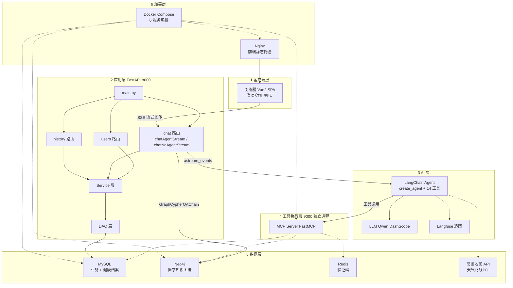
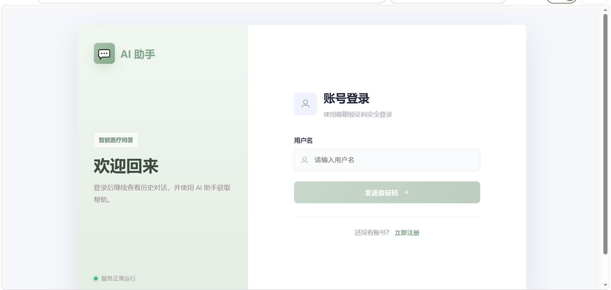
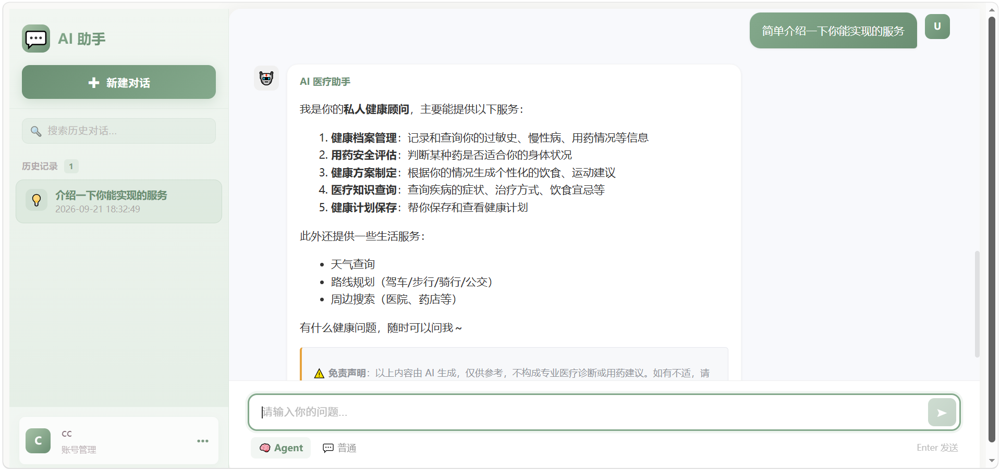
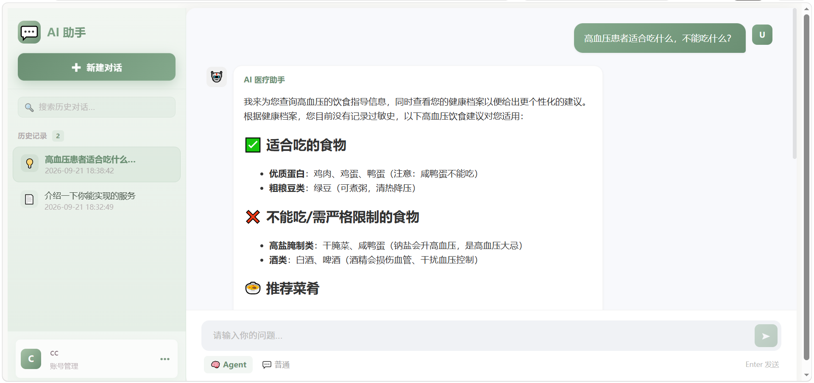
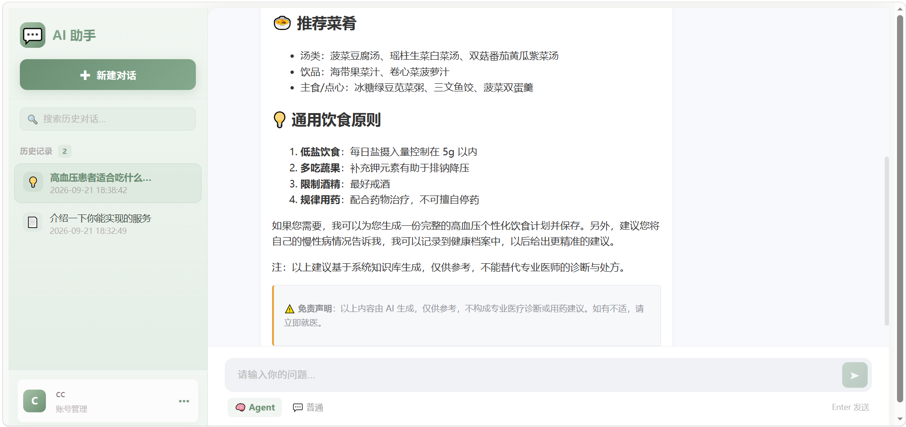
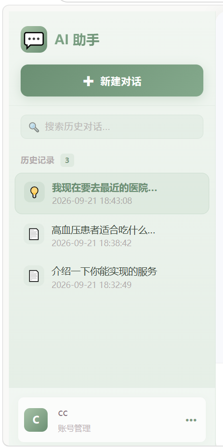

# 医疗知识 RAG 系统（AI 健康 Agent）

基于大模型与医学知识图谱的医疗健康 **Agent 系统**。针对通用大模型在垂直医疗场景的两大痛点——**易产生幻觉**与**缺乏患者个性化记忆**——引入「感知-规划-行动」闭环，结合用户健康画像（MySQL）与医学知识图谱（Neo4j），提供个性化的用药评估与就医建议。

## ✨ 项目简介

- **个性化医疗决策**：当用户问「我能不能吃布洛芬」时，系统先调出该用户的过敏史/慢病/用药，再结合知识图谱做药物禁忌评估，给出「针对这个人」的建议，而非背课本。
- **Agent 工具编排**：单 Agent 编排 14 个工具（健康档案、药物安全性评估、知识图谱检索、时间感知、天气/路线/POI 等），由模型自主规划路由。
- **流式响应**：基于 SSE 实现逐 token 流式输出，用户无需等待完整生成。

## 🏗️ 系统架构



## 🛠️ 技术栈

| 层 | 技术 |
|----|------|
| 后端 | Python 3.10 · FastAPI · Uvicorn · LangChain 1.x · LangChain-Neo4j · FastMCP |
| 大模型 | Qwen（阿里云 DashScope，OpenAI 兼容接口） |
| 数据 | MySQL 8（业务 + 健康档案） · Neo4j 5（知识图谱） · Redis 7（验证码） |
| 前端 | Vue 2.5 · Webpack 3 · Element UI · axios · markdown-it |
| 部署 | Docker · Docker Compose（6 服务） · Nginx（前端静态托管） |
| 可观测 | Langfuse（全链路追踪） |
| 外部 API | 高德地图 API（天气 / 路线规划 / POI 搜索） |

## ✨ 核心功能

- **邮箱验证码登录** / 注册 / 注销（Redis 存验证码，60s TTL）
- **SSE 流式聊天**：Agent 模式（`/chat/chatAgentStream`）与图谱问答模式（`/chat/chatNoAgentStream`）双路径
- **单 Agent 编排 14 工具**：健康画像、药物安全性评估、疾病指导、知识图谱检索、时间感知等
- **医学知识图谱检索**：疾病/症状/检查/药物/科室/食物/菜肴/分类/治疗方式 9 类节点
- **对话历史管理**：查询、关键词搜索、重命名、删除

## 💡 核心技术亮点

1. **流式事件机制深挖 + 两层过滤**：定位并解决 LangChain 1.x 中 `astream_events` 事件从 `on_chat_model_stream` 变更为 `on_chain_stream`（底层为 LangGraph 状态图）的兼容问题；设计「消息类型过滤 + JSON 嗅探」两层机制，精准剥离工具调用的中间态 JSON，仅向前端推送纯净回复文本。
2. **单 Agent 多工具 · 结构化反馈闭环**：工具统一返回 `{status, result}`，系统提示词强制模型先判读结果再答复，抑制「工具调用失败仍谎报成功」的幻觉。
3. **图数据库 RAG + 疾病名歧义消解**：`GraphCypherQAChain` 实现 schema 感知的自然语言转 Cypher；设计「CONTAINS 召回 + 规则打分」两步消歧，解决「高血压 vs 原发性高血压」类模糊匹配。
4. **工程化与鲁棒性**：Docker Compose 编排 6 服务、Langfuse 可观测、60s 空闲超时、`rowcount` 三态校验、免责声明双保险。

## 🚀 快速开始

> 环境要求：本项目需要 **Neo4j 4.x 及以上版本**（`CREATE CONSTRAINT IF NOT EXISTS` 语法要求）。`docker-compose.yml` 已指定 `neo4j:5` 镜像，无需手动配置。

### Docker 一键启动（推荐）

#### 1. 复制环境变量并填入真实 Key

> `.env` 含密钥，**不进仓库**（已被 `.gitignore` 忽略）；首次部署需自行 `cp .env.example .env` 并填入真实 Key。

```bash
cp .env.example .env
# 编辑 .env，至少填入：
#   DASHSCOPE_API_KEY=<你的 DashScope Key>
#   AMAP_API_KEY=<你的高德 Key>（可选，天气/路线/POI 用）
#   SMTP_PASSWORD=<你的 SMTP 授权码>（可选，邮箱验证码用）
#   LANGFUSE_*（可选，全链路追踪用）
```

#### 2. 一键启动所有服务

```bash
docker compose up -d
```

编排 6 个服务：

| 服务 | 镜像 | 端口 | 说明 |
|------|------|------|------|
| mysql | mysql:8.0 | 3306 | 业务数据 + 健康档案 |
| neo4j | neo4j:5 | 7475 / 7688 | 医疗知识图谱 |
| redis | redis:7-alpine | 6379 | 邮箱验证码 |
| mcp-server | 本地构建 | 9000 | MCP 工具执行层 |
| backend | 本地构建 | 8000 | FastAPI + Agent |
| frontend | 本地构建 | 8080 | Vue 前端 |

#### 3. 访问地址

```bash
# 前端:  http://localhost:8080
# 后端:  http://localhost:8000
# Neo4j: http://localhost:7475（账号 neo4j，密码见 .env 的 NEO4J_PASSWORD；Bolt: bolt://localhost:7688）
```

#### 停止服务

```bash
docker compose down          # 停止并删除容器（保留数据卷）
docker compose down -v       # 停止并删除容器 + 数据卷（清空数据库）
```

#### 查看日志

```bash
docker compose logs -f backend
docker compose logs -f mcp-server
```

### 本地开发启动（非 Docker）

> 适合调试。前置条件：MySQL / Neo4j / Redis 已就绪，`.env` 已配置。

**后端**（两个终端）：

```bash
cd rag_server
pip install -r requirements.txt

# 终端 1：启动 MCP 工具服务（端口 9000）
python mymcp/MCPServer.py

# 终端 2：启动 FastAPI 后端（端口 8000）
python main.py
```

**前端**：

```bash
cd rag_app
npm install
npm run dev    # http://localhost:8080
```

> 提示：只想用 Docker 起中间件、本地跑代码，可执行 `docker compose up -d mysql neo4j redis`。

## 📁 目录结构

```
RAG/
├── rag_server/              # 后端 (FastAPI + LangChain Agent + MCP)
│   ├── main.py              # FastAPI 入口（lifespan 创建 Agent、注册路由、CORS）
│   ├── ai/                  # Agent 定义：LoadAgent / LoadLLM / LoadTools / AmapUtil
│   ├── chat/                # 聊天模块：controller / service / dao / utils(ChatUtil)
│   ├── users/               # 用户模块：controller / service / dao
│   ├── common/              # 公共工具：config / MySQLUtil / DateUtil / LangfuseUtil ...
│   ├── health/              # 健康档案 DAO（画像/过敏/慢病/用药/计划）
│   ├── entity/              # Pydantic 模型
│   ├── mymcp/               # MCPServer（工具执行层）+ MCPClient
│   ├── sql/                 # 建表脚本
│   └── scripts/             # 评估脚本 / 测试数据插入脚本
├── rag_app/                 # 前端 (Vue2 + Webpack3)
│   └── src/                 # views(登录/注册/聊天) + router + main.js
├── docs/                    # 文档（Neo4j 数据初始化说明）
├── docker-compose.yml       # 6 服务编排
├── .env.example             # 环境变量模板
└── README.md
```

## 🖼️ 界面截图










## 📚 数据初始化

> 医疗知识图谱数据来自公开医疗知识数据集（约 2.7 万节点 / 31 万关系），随仓库分发，clone 后即可直接导入，无需额外下载。

- 医学知识图谱：`docker compose up` 时由 `neo4j-import` 一次性服务**自动批量导入**（读取 `rag_server/neo4j-data/` 下的 CSV，约 2.7 万节点 / 31 万关系），无需手动操作；手动导入与最小示例见 **[docs/neo4j-setup.md](./docs/neo4j-setup.md)**。
- **首次导入约需 5-10 分钟**（取决于机器性能），请耐心等待，容器并非卡死。可执行 `docker compose logs -f neo4j-import` 查看导入进度。
- 健康档案测试数据：`cd rag_server && python scripts/insert_test_data.py test@example.com`（会为指定用户插入画像/过敏/慢病/用药）。

**验证图谱导入是否完整**（预期节点 27511、关系 313993）：

```bash
docker exec -it rag-neo4j cypher-shell -u neo4j -p <密码> "MATCH (n:Disease) RETURN count(n)"
# 预期返回 27511

docker exec -it rag-neo4j cypher-shell -u neo4j -p <密码> "MATCH ()-[r]->() RETURN count(r)"
# 预期返回 313993
```

## 📄 许可证与链接

- 项目仓库：https://github.com/eszxc1/medical-health-agent
- 许可证：[MIT License](./LICENSE)